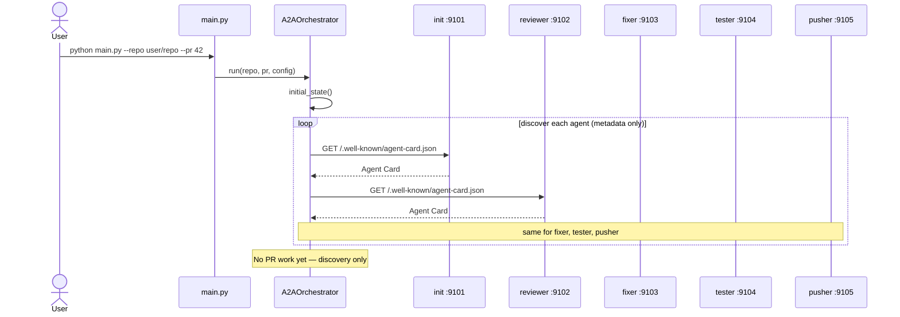
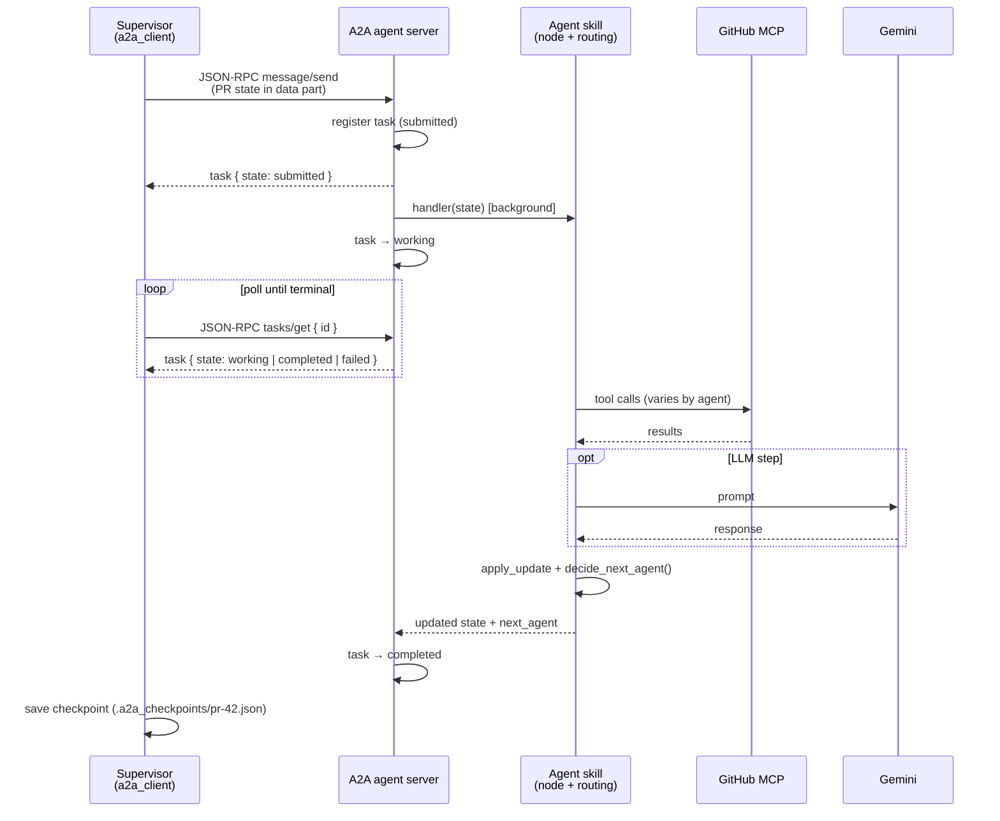
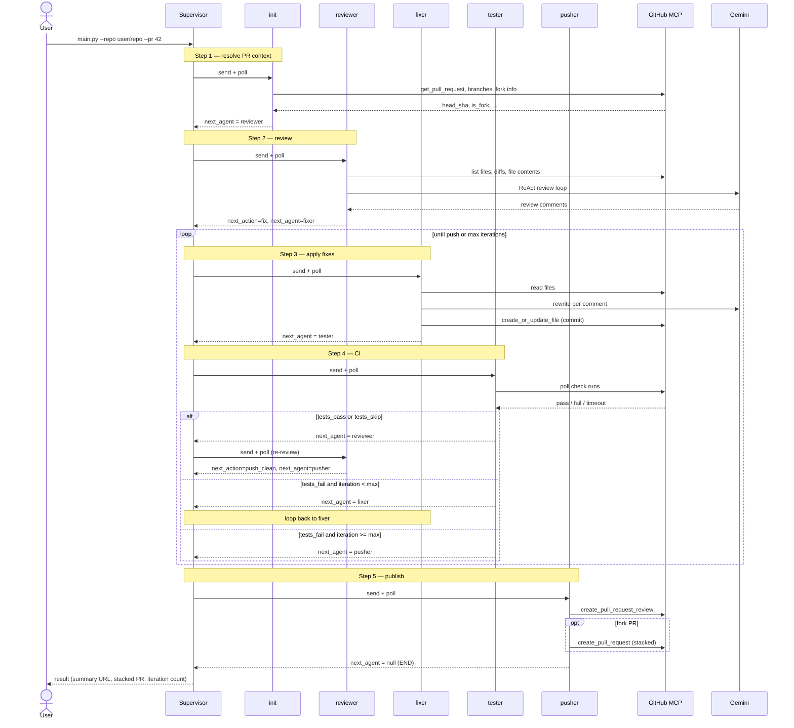
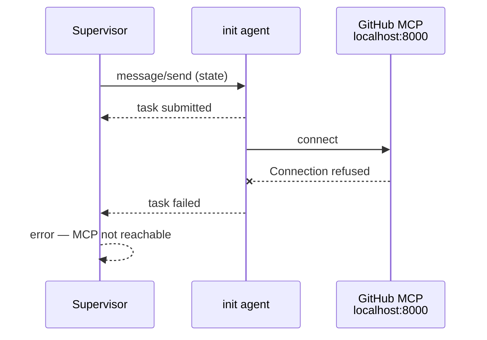

# Orchestration_A2A — Workflow & Sequence Diagrams

End-to-end flow for the PR review / fix / test / push mesh: what runs where,
how A2A messages move state, and how routing works without a central graph.

## Architecture (three layers)

```text
You (CLI: main.py)
   │
   ▼
Supervisor (orchestrator.py + a2a_client.py)   ← A2A client, owns NO workflow graph
   │  discover → message/send → tasks/get poll → follow next_agent
   ▼
A2A agent servers (run_agents.py, ports 9101–9105)
   │  init / reviewer / fixer / tester / pusher
   ▼
GitHub MCP + Gemini
   │  PR metadata, commits, CI polls, review posts
   ▼
GitHub (repo / pull request)
```

### Runtime prerequisites

| Layer | How to start | Default |
|-------|----------------|---------|
| GitHub MCP | Docker `github-mcp-server` **or** hosted URL in `.env` | `http://localhost:8000` |
| A2A agents | `python run_agents.py` | `9101–9105` |
| Supervisor | `python main.py --repo owner/repo --pr N` | — |

All three must be reachable. If MCP is down, **init** fails immediately with a
connection error to `localhost:8000`.

---

## 1. Startup & discovery

Discovery fetches **Agent Cards only** — no PR state is sent yet.



Console output looks like:

```text
[A2A discover] init     → pr-init-agent @ http://127.0.0.1:9101
[A2A discover] reviewer → pr-reviewer-agent @ http://127.0.0.1:9102
...
```

---

## 2. One A2A call (message/send + tasks/get poll)

Every agent step uses the same strict A2A task lifecycle:

`submitted → working → completed | failed`



Poll interval: `A2A_POLL_INTERVAL_S` (default `2.0` seconds).

---

## 3. Supervisor driver loop (no hardcoded graph)

The supervisor never encodes init → reviewer → fixer → …. It only follows
`state["next_agent"]` returned by each agent (`agents/routing.py`).

```text
current = init   (or resumed next_agent from checkpoint)
while current is not None:
    state   = call_agent(current, state)   # send + poll to completion
    current = state["next_agent"]
```

A step budget prevents infinite routing loops if an agent misbehaves.

---

## 4. Full PR workflow (happy path + loops)



### Emergent routing table (`agents/routing.py`)

| Agent | Typical `next_agent` |
|-------|----------------------|
| init | `reviewer` (or `pusher` on fatal init error) |
| reviewer | `fixer` if fixable issues; else `pusher` |
| fixer | `tester` (or `pusher` if fix failed / maxed) |
| tester | `reviewer` on pass/skip; `fixer` on fail (iter < max); `pusher` on fail (iter ≥ max) |
| pusher | `null` (END) |

### Routing diagram

```text
                    ┌─────────┐
                    │  init   │
                    └────┬────┘
                         ▼
                    ┌──────────┐
              ┌────►│ reviewer │◄──────────────┐
              │     └────┬─────┘               │
              │          │ fix                 │ tests_pass / tests_skip
              │          ▼                     │
              │     ┌─────────┐                │
              │     │  fixer  │                │
              │     └────┬────┘                │
              │          ▼                     │
              │     ┌─────────┐                │
              └─────│ tester  │────────────────┘
                    └────┬────┘
                         │ tests_fail + max iter / push_*
                         ▼
                    ┌─────────┐
                    │ pusher  │ → END
                    └─────────┘
```

---

## 5. Shared state fields

One JSON object (`OrchestrationState` in `state.py`) is passed in every A2A
message and returned in every completed task artifact.

| Category | Key fields |
|----------|------------|
| Inputs | `repo_owner`, `repo_name`, `pr_number`, `max_iterations`, `fix_severities` |
| Init output | `head_branch`, `head_sha`, `is_fork`, `ai_fix_branch`, `init_brief`, `init_done` |
| Loop | `iteration`, `review_comments`, `fixes_history`, `test_history` |
| Step outcome | `next_action` — what this agent decided (fix, push_clean, tests_fail, …) |
| Routing | `next_agent` — who the supervisor should call next (`null` = stop) |
| Final | `summary_review_url`, `stacked_pr_url`, `error` |
| Trace | `a2a_events` — per-step log for debugging |

---

## 6. Failure example — MCP not running



Fix: start Docker + `github-mcp-server`, or set
`MCP_SERVER_URL=https://api.githubcopilot.com/mcp/` in `.env` and restart
`run_agents.py`.

---

## 7. Resume from checkpoint

After each completed A2A call the supervisor writes:

```text
.a2a_checkpoints/pr-<N>.json
```

Resume continues from the saved `next_agent`:

```bash
python main.py --repo owner/repo --pr 42 --resume
```

---

## Key code references

| Concern | File |
|---------|------|
| Generic driver loop | `orchestrator.py` → `_run_from_state` |
| Send + poll client | `a2a_client.py` → `send_state`, `_poll` |
| Task lifecycle server | `a2a_server.py` → `message/send`, `tasks/get` |
| Per-agent next hop | `agents/routing.py` |
| Stamp `next_agent` on results | `agent_apps.py` |
| CLI entry | `main.py` |
