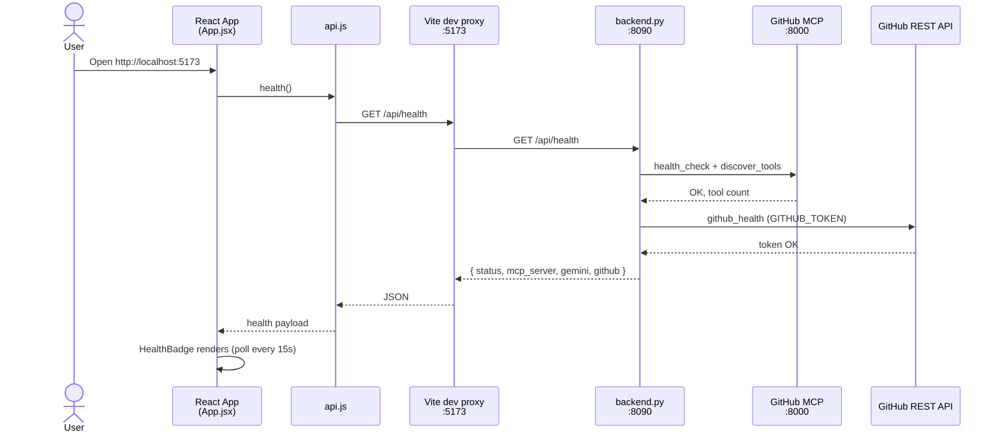
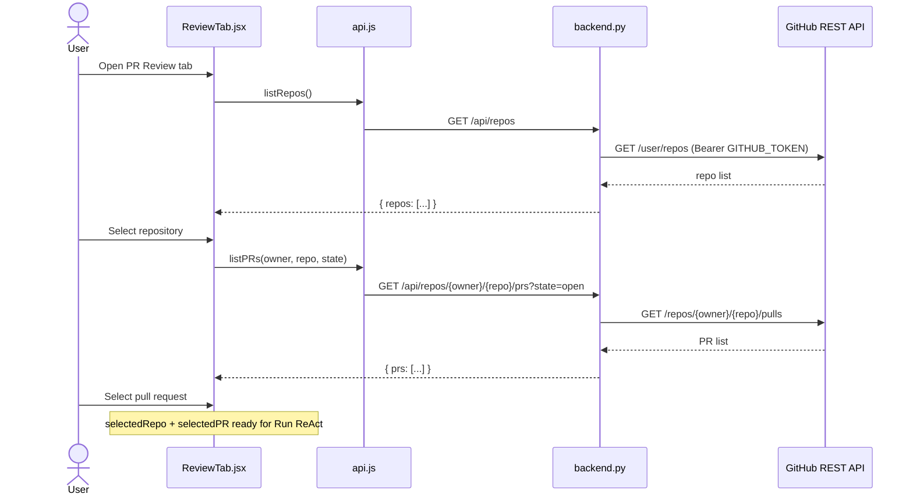
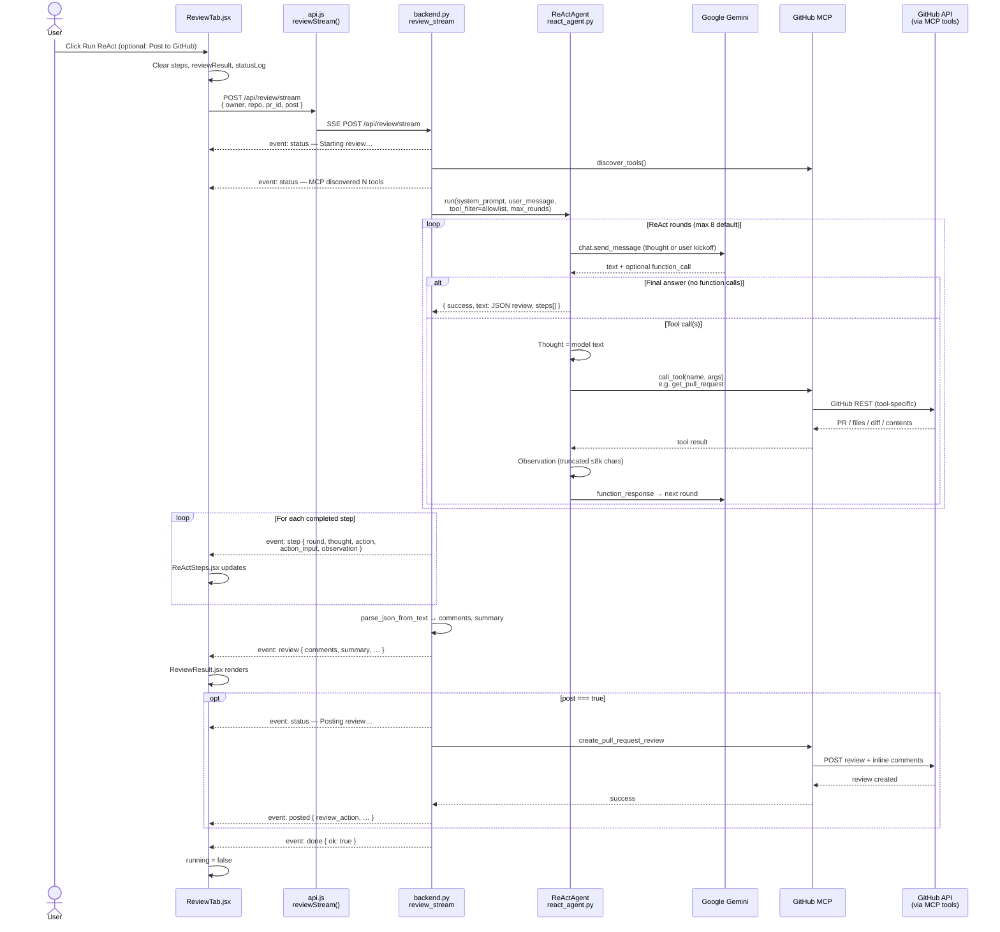
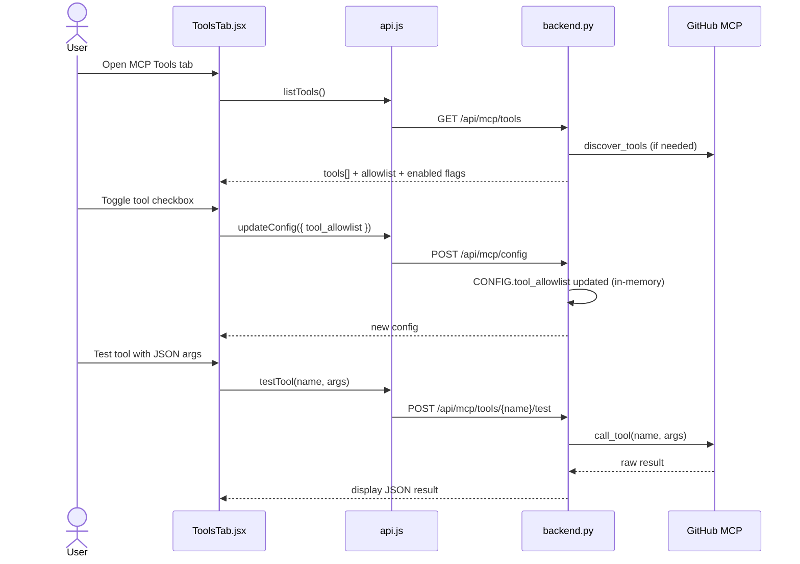
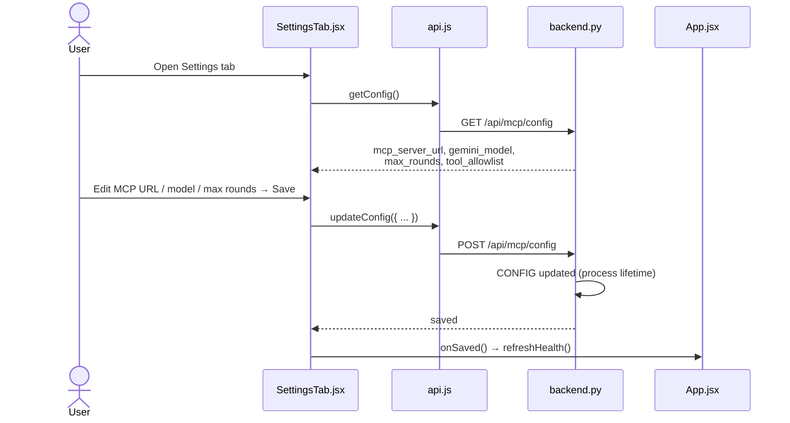

# ReAct PR Review — UI End-to-End Flow (Sequence Diagrams)

How the **React UI** drives a PR review from browser click through FastAPI,
Gemini ReAct loop, and GitHub MCP.

**Stack:** Vite `:5173` → proxy `/api` → FastAPI `:8090` → `ReActAgent` + `MCPClient` → GitHub MCP `:8000`

---

## 1. App startup & health



---

## 2. PR Review tab — browse repos & PRs (no ReAct yet)

Repo/PR lists use **direct GitHub REST** (`github_api.py`), not MCP.



---

## 3. Run ReAct review (main flow, SSE stream)



### Typical MCP tool order inside the loop

| Round | Action (example) | Observation |
|-------|------------------|-------------|
| 1 | `get_pull_request` | PR title, branches, body |
| 2 | `get_pull_request_files` | Changed files + patches |
| 3+ | `get_file_contents` / `get_pull_request_diff` | Extra context |
| Last | *(none)* | Final JSON `{ comments, summary }` |

---

## 4. MCP Tools tab — allowlist & test call



---

## 5. Settings tab — runtime config



---

## 6. Component ↔ API map

| UI component | API (`api.js`) | Backend route |
|--------------|----------------|---------------|
| `HealthBadge` | `health()` | `GET /api/health` |
| `ReviewTab` | `listRepos`, `listPRs` | `GET /api/repos`, `GET .../prs` |
| `ReviewTab` | `reviewStream` | `POST /api/review/stream` |
| `ReActSteps` | *(SSE `step` events)* | — |
| `ReviewResult` | *(SSE `review` event)* | — |
| `ToolsTab` | `listTools`, `updateConfig`, `testTool` | `GET/POST /api/mcp/*` |
| `SettingsTab` | `getConfig`, `updateConfig` | `GET/POST /api/mcp/config` |

---

## 7. Dev proxy (how `/api` reaches the backend)

```text
Browser  http://localhost:5173/api/health
    ↓  vite.config.js proxy
FastAPI  http://localhost:8090/api/health
```

```6:14:ReAct/ui/vite.config.js
  server: {
    port: 5173,
    proxy: {
      '/api': {
        target: 'http://localhost:8090',
        changeOrigin: true,
      },
    },
  },
```

---

## 8. SSE event types (`POST /api/review/stream`)

| Event | When | UI handler |
|-------|------|------------|
| `status` | Start, MCP ready, posting | `statusLog` |
| `step` | After agent completes (per round) | `steps[]` → `ReActSteps` |
| `review` | Parsed JSON review | `reviewResult` → `ReviewResult` |
| `posted` | After `create_pull_request_review` | `statusLog` |
| `error` | Failure | `statusLog` |
| `done` | Stream finished | `statusLog`, `running=false` |

---

## Run locally

```bash
# Terminal 1 — GitHub MCP
docker run -d --name github-mcp -p 8000:8082 \
  -e GITHUB_PERSONAL_ACCESS_TOKEN=$GITHUB_TOKEN \
  ghcr.io/github/github-mcp-server:latest http --port 8082

# Terminal 2 — API
cd ReAct && python backend.py

# Terminal 3 — UI
cd ReAct/ui && npm install && npm run dev
# → http://localhost:5173
```

See also [README.md](README.md) for CLI (`main.py`) and environment variables.
