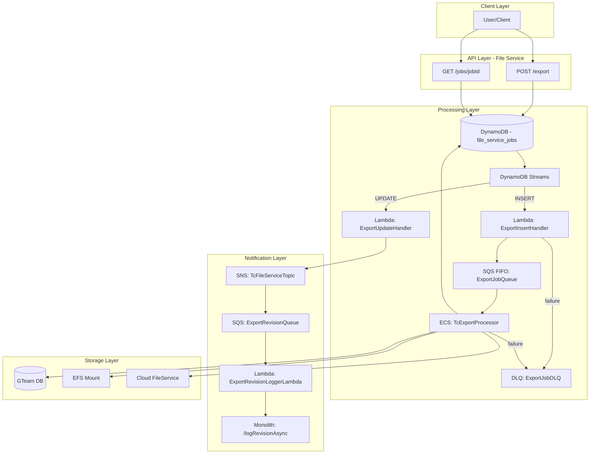

# Async Folder Export Implementation Plan

## Summary

Transform the synchronous folder export in Trimble Connect to an asynchronous, event-driven architecture using AWS services. The new system will handle large folder exports (up to 10GB) without blocking, provide job status tracking, and generate pre-signed download URLs valid for 48 hours.

## Architecture Overview




## API Contract

### POST /export

Creates an asynchronous export job.

**Request Body:**

```json
[
  { "id": "folder-123", "type": "FOLDER" },
  { "id": "file-456", "type": "FILE" }
]
```

**Validation Rules:**

- Maximum 20 object IDs per request (based on metrics: 99.9% of requests use 6 or fewer IDs)
- Maximum archived file size: 10GB
- User must have READ permission on all objects
- Empty payload returns 400 Bad Request

**Responses:**

- `202 Accepted` with `Location` header containing jobId
- `400 Bad Request` for empty payload or exceeding limits
- `403 Forbidden` if user lacks permissions

### GET /jobs/{jobId}

Retrieves job status and download URL.

**Query Parameters:**

- `fields` (optional): `input`, `result` - additional fields to include
- `wait` (optional): `true`/`false` - enable long polling

**Response (DONE):**

```json
{
  "jobId": "job-abc123",
  "status": "DONE",
  "createdBy": "users:tiduuid:xxxxx",
  "createdAt": "2025-05-07T12:00:00Z",
  "updatedAt": "2025-05-07T12:15:00Z",
  "result": {
    "downloadUrl": "https://..."
  }
}
```

**Response (FAILED):**

```json
{
  "jobId": "job-abc123",
  "status": "FAILED",
  "result": {
    "error": {
      "code": "PERMISSION_DENIED",
      "message": "User does not have permission"
    }
  }
}
```

## DynamoDB Schema

**Table:** `file_service_jobs`


| Attribute   | Type      | Description                      |
| ----------- | --------- | -------------------------------- |
| jobId (PK)  | String    | UUID                             |
| jobType     | String    | EXPORT, FOLDER_DELETION          |
| status      | String    | QUEUED, PROCESSING, DONE, FAILED |
| projectId   | String    | Associated project               |
| createdBy   | Map       | tc_user_id and tiduuid           |
| createdAt   | Timestamp | Job creation time                |
| updatedAt   | Timestamp | Last update time                 |
| input       | Map       | Request payload                  |
| result      | Map       | downloadUrl or error             |
| expireAt    | Timestamp | TTL (30 days)                    |
| fsUploadId  | String    | FileService upload ID            |
| downloadUrl | String    | Pre-signed URL (48hr validity)   |


## Implementation Components

### 1. File Service API (Export Processor)

- Validate request and permissions (project access, admin or READ)
- Feign call to Monolith `/operations` for syncSession/batchId or create new activity
- Create job entry in DynamoDB with status `QUEUED`
- Return 202 with jobId in Location header

### 2. Lambda: ExportInsertHandler

- Triggered by DynamoDB Streams (INSERT events)
- Parse stream event, extract job details
- Validate job entry
- Enqueue to SQS FIFO with `projectId` as MessageGroupId
- Send failures to DLQ

### 3. SQS FIFO: ExportJobQueue

- FIFO queue for ordered processing per project
- Triggers ECS task

### 4. ECS: TcExportProcessor

- Batch size: 1 job per task
- Default: 2 tasks, scales up to 40 based on `ApproximateNumberOfMessagesVisible > 5`
- Processing steps:
  1. Retrieve files, folders, subfolders with hierarchy
  2. Query GTeam DB for metadata per storage_object_id
  3. Check preconditions (associations, checkout, permissions)
  4. If any object lacks READ permission, mark job as FAILED
  5. Archive all files maintaining folder hierarchy
  6. Upload to Cloud FileService (single-part up to 5GB, multi-part for larger)
  7. Update DynamoDB status to DONE/FAILED
  8. Generate pre-signed URL (48hr expiry)

### 5. Lambda: ExportUpdateHandler

- Triggered by DynamoDB Streams (UPDATE events where status = DONE)
- Publish event to existing SNS topic (TcFileServiceTopic)

### 6. SQS: ExportRevisionQueue

- Subscribed to TcFileServiceTopic
- Triggers ExportRevisionLoggerLambda

### 7. Lambda: ExportRevisionLoggerLambda

- Parse SNS event from SQS
- Call Monolith `POST /logRevisionAsync` for revision logs

### 8. DLQ: ExportJobDLQ

- Captures failed events from InsertHandler and ECS processor

## Metrics Analysis (from download_api_metrics.csv)

Based on 6 months of `/folders/download` API access logs (1,175 requests):


| ID Count | Requests | Percentage |
| -------- | -------- | ---------- |
| 1        | 713      | 60.7%      |
| 3        | 223      | 19.0%      |
| 6        | 227      | 19.3%      |
| 2        | 9        | 0.8%       |
| 4        | 1        | 0.1%       |
| 9        | 1        | 0.1%       |
| 22       | 1        | 0.1%       |


**Conclusion:** Setting limit to 20 IDs covers 99.9% of use cases. Max observed was 22 (single outlier).

## Scalability Configuration

- Default concurrent ECS tasks: 2
- Maximum concurrent ECS tasks: 10 (adjustable based on performance)
- Scale-up trigger: `ApproximateNumberOfMessagesVisible > 5` in CloudWatch
- Production load: ~2 requests/minute for download API

## Upload Mechanism

- **Single-part upload:** Files up to 5GB
- **Multi-part upload:** Files between 5GB-10GB
  - Part size: 5MB-5GB (except last part)
  - Maximum parts: 10,000

## Future Considerations

- Folder permission inheritance (planned for September 2025) will change permission checking logic
- Remove logic that includes parent folders up to root

## Infrastructure Requirements

- DynamoDB table with TTL enabled
- DynamoDB Streams enabled
- 3 Lambda functions
- 2 SQS queues (1 FIFO, 1 standard)
- 1 DLQ
- ECS task definition with auto-scaling
- SNS topic subscription
- EFS mount for file processing
- IAM roles for Lambda, ECS with appropriate permissions

